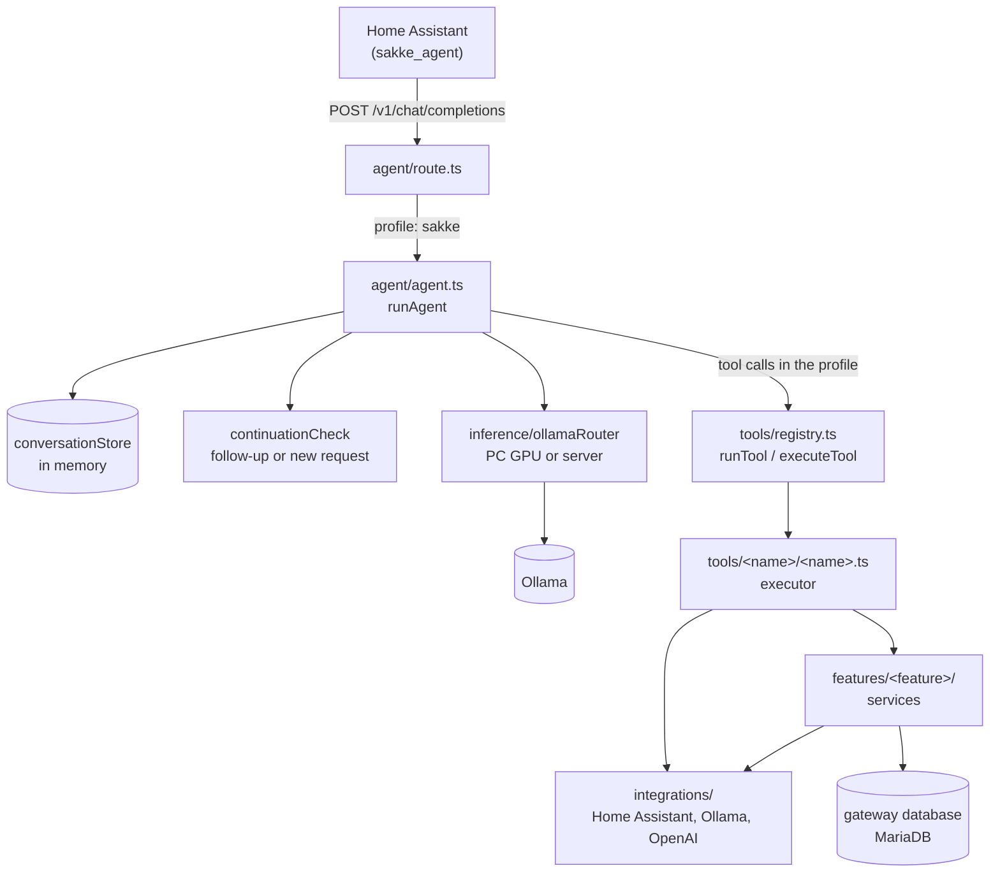

# sakke-gateway architecture

How the gateway works inside: what happens to a request, which module owns
what, and the rules that keep it that way. The whole system (Home Assistant,
the voice satellite, the bot, the server) is described in
[sakke-workspace's architecture docs](https://github.com/saarinenvh/sakke-workspace/tree/main/docs/architecture).

This describes the code as it is. A change to the structure or the data flow
updates these files in the same pull request.

| File | Covers |
| --- | --- |
| [tools.md](tools.md) | how a tool is built, the registry, request profiles |
| [data.md](data.md) | the gateway database, who owns which table, migrations |

## A conversation turn



1. **The route** takes the last user message and the conversation id, and
   calls `runAgent` with the `sakke` profile.
2. **The agent** looks up the conversation. If Sakke asked something last turn,
   the follow-up classifier decides whether this is an answer, a new request or
   noise; noise gets silence. A new conversation starts with the system
   prompt, built from every feature's `prompt.ts`.
3. **Routing** picks an Ollama once per turn: the dev PC's GPU when it reports
   itself available, otherwise the server.
4. **The tool loop** offers the model only the profile's tools. Each call goes
   through the registry to the tool's executor, and its result is fed back
   until the model answers in prose, repeats itself, or runs out of iterations.
5. **The answer** is cleaned for speech, stored with the conversation, and
   returned. The display is told what Sakke is doing throughout.

Proactive speech takes other paths: the tidiness coach asks through
`assist_satellite.start_conversation`, announcements go through
`features/announcements/`, used by timers and scheduled jobs, the morning
wake-up speaks a phone notification (`integrations/homeAssistant/phone.ts`), and
the morning brief speaks already-worded text on the satellite.

## Modules

| Module | Owns | Doesn't |
| --- | --- | --- |
| `index.ts` | startup: wiring, config report, restoring state, connecting the database, listening | business logic |
| `app.ts` | the HTTP routes, so tests can use `app.inject()` | side effects |
| `config.ts` | every environment variable, read once, validated, problems logged | reading env anywhere else |
| `agent/` | the conversation turn: history, follow-ups, the system prompt, the tool loop | tool logic |
| `inference/` | request profiles, which Ollama a request goes to, the request's shape, and `writeText`: one piece of text in Sakke's voice for a feature | conversations, tools |
| `tools/` | what the model can call: definitions, executors, the registry | database access, deeper business logic |
| `features/` | services: business logic, state, a feature's own routes, its tables | the model's tool contract |
| `integrations/` | talking to Home Assistant, Ollama and OpenAI | deciding anything |
| `db/` | the database connection, retries, migrations | any feature's tables or queries |

### Files

```
src/
├── config.ts             # all configuration, read once, validated, problems logged at startup
├── app.ts                # buildApp() — routes only, so tests can inject
├── index.ts              # composition root: wiring, then listen
├── tests/                # config.test.ts, testLayout.test.ts (tests sit in tests/ folders)
├── db/                   # infrastructure only: dataSource.ts, database.ts (connect
│                         # with retry), migrations/ - the one ordered schema history
├── inference/
│   ├── profiles.ts       # which tools each kind of request may use
│   ├── ollamaRouter.ts   # which Ollama a request goes to
│   ├── ollamaRequest.ts  # the shape of Sakke's requests: model, options, tools
│   ├── writeText.ts      # one piece of text in Sakke's voice, for a feature
│   ├── systemPrompt.ts   # the system prompt builder, wired in by index.ts
│   ├── voiceText.ts      # strips anything that shouldn't be spoken aloud
│   └── tests/
├── agent/
│   ├── agent.ts          # the conversation turn: the tool-calling loop
│   ├── conversationStore.ts  # history, pruning, context-budget trimming
│   ├── continuationCheck.ts  # the follow-up classifier
│   ├── systemPrompt.ts   # concatenates the per-feature fragments
│   ├── prompts/          # persona.md, toolDiscipline.md
│   └── tests/
├── tools/
│   ├── registry.ts       # the one tool list, and the one try/catch
│   ├── parameters.ts     # toolParameters(): a tool's parameters from its Zod schema
│   ├── types.ts
│   ├── tests/            # definitions.test.ts, __snapshots__/toolDefinitions.json
│   └── homeControl/  lists/  spotify/  weather/  search/  reminders/
│       schedule/  tv/  wiki/  gpu/  vacuum/  announce/  coffee/
│                         # only the model's interface: tool.ts, schema.ts (the
│                         # arguments), tests/, and as needed prompt.ts and the
│                         # executor <name>.ts; services live in features/, HTTP
│                         # in integrations/ (see tools.md)
├── features/
│   └── scenes/  display/  gpu/  tidiness/  announcements/  scheduling/  morning/
│       reminders/  wiki/  spotify/
│                         # services with their own routes, logic and tables, not in
│                         # tools/registry.ts - nothing the model calls directly.
│                         # Each has a README.md (what it does, entry points, the
│                         # tables it owns) and tests/; scheduling/ and morning/
│                         # keep their entities and repositories in db/
├── integrations/
│   ├── homeAssistant/client.ts  # the only place that talks HTTP to HA
│   ├── homeAssistant/schema.ts  # what HA sends back: full examples + Zod schemas
│   ├── homeAssistant/registry.ts  # areas, scenes, scripts, entities
│   ├── homeAssistant/phone.ts     # spoken notifications on the phone (Companion app)
│   ├── ollama/           # client.ts (request/response/errors), schema.ts, types.ts
│   ├── openai/           # client.ts, schema.ts
│   ├── searxng/          # web search
│   ├── openMeteo/        # the forecast, and its wording (weather.ts)
│   ├── spotify/          # the Spotify Web API (token, search, albums)
│   └── pcStatus/         # the PC's status service (/unload)
└── util/                 # async, text, time, validation (parseOrThrow)

tests/                    # tests that cross modules
├── integration/          # the Fastify app through app.inject(), and the real database
└── fixtures/             # fakes they share: fakeOllama, fakeHomeAssistant, fakeJobStore
```

What each feature does, and what it owns, is in its `README.md`.

The layout follows the folder-structure convention in sakke-workspace's
[`.agents/code-style.md`](https://github.com/saarinenvh/sakke-workspace/blob/main/.agents/code-style.md)
("Folder structure"): fixed names for a feature's parts (`route.ts`,
`schema.ts`, `policy.ts`, `prompts.ts`, `db/`, `tests/`), every module's tests
in a `tests/` subfolder, and fakes used by one module in that module's
`tests/`. `tsconfig.build.json` leaves every `tests/` folder out of the build,
and `src/tests/testLayout.test.ts` fails if a `*.test.ts` file sits outside one.

Every feature's `prompt.ts` is concatenated into the system prompt in a fixed
order by `agent/systemPrompt.ts`. Adding a feature means adding a folder, not
editing shared files.

## Dependency rules

Dependencies point one way: routes → agent → tools → features → integrations
and the database.

- **A tool folder never imports `db/` or TypeORM.** It calls the feature that
  owns the data. See [tools.md](tools.md).
- **Features and `inference/` don't import tools or the agent.** A feature
  that needs text in Sakke's voice calls `inference/writeText`. Two things
  still come from above, and `index.ts` wires them in at startup: the system
  prompt builder (it's composed from every tool's `prompt.ts`), and the tool
  registry for the scheduler (`JobRunner` and the schedulability check). The
  agent imports every tool, so a direct import would close a cycle.
- **Nothing outside `tools/` imports a tool folder's internals,** only its
  `tool.ts` (the registry) and `prompt.ts` (the system prompt).
- **Only the owning module writes a table.** See [data.md](data.md).
- **Integrations are the only code that talks HTTP** to their service, with
  their own timeouts and error types. Responses are validated with Zod.
  `src/tests/moduleBoundaries.test.ts` fails on a `fetch(` outside
  `integrations/`, on an import of a tool folder's internals, and on
  `features/` or `inference/` importing the agent or the tools.

## Boundary schemas

Every place data crosses into the gateway has a `schema.ts` next to the code
that owns it: an integration's responses, a route's request body, a tool's
arguments. Each file starts by naming who sends what over which transport. It
then holds, per payload, an exported `…Example` with the **full** payload,
including fields the gateway ignores (marked `// ignored`), and the Zod schema
that declares only what the code reads. A `schema.test.ts` in the module's
`tests/` folder parses every example, so an example can't drift away from its schema.

To see what crosses a boundary and what is used, read its `schema.ts`.

## Startup

`index.ts`, in order:

1. Wires in what can't be imported: the system prompt builder, for `inference/`.
2. Logs every configuration problem, without refusing to start.
3. Starts connecting to the database in the background; it retries every 30 s
   and runs pending migrations once connected. Then it imports any timers left
   in `timers.json` and starts the scheduler, which arms every pending job.
   Until then, scheduling reports itself unavailable. The morning wake-up
   and brief start at the same point, since all their state is in the database.
4. Restores the tidiness coach's state and starts it.
5. Loads the Home Assistant entity registry, and listens whether or not that
   worked.

Nothing waits on Home Assistant or the database: the gateway comes up and says
what's missing.
