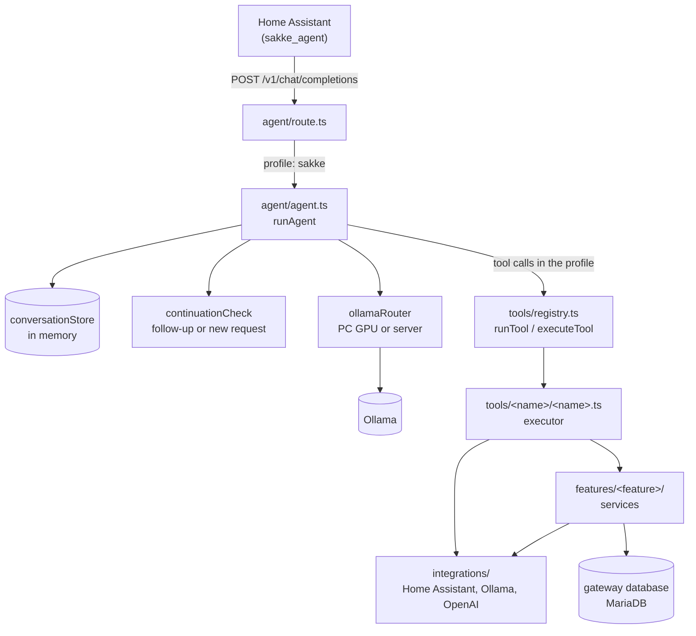

# sakke-gateway architecture

How the gateway works inside: what happens to a request, which module owns
what, and the rules that keep it that way. The whole system (Home Assistant,
the voice satellite, the bot, the server) is described in
[sakke-workspace's architecture docs](https://github.com/saarinenvh/sakke-workspace/tree/main/docs/architecture).

This describes the code as it is. A change to the structure or the data flow
updates these files in the same pull request.

| File | Covers |
| --- | --- |
| [tools.md](tools.md) | how a tool is built, the registry, request profiles |
| [data.md](data.md) | the gateway database, who owns which table, migrations |

## A conversation turn



1. **The route** takes the last user message and the conversation id, and
   calls `runAgent` with the `sakke` profile.
2. **The agent** looks up the conversation. If Sakke asked something last turn,
   the follow-up classifier decides whether this is an answer, a new request or
   noise; noise gets silence. A new conversation starts with the system
   prompt, built from every feature's `prompt.ts`.
3. **Routing** picks an Ollama once per turn: the dev PC's GPU when it reports
   itself available, otherwise the server.
4. **The tool loop** offers the model only the profile's tools. Each call goes
   through the registry to the tool's executor, and its result is fed back
   until the model answers in prose, repeats itself, or runs out of iterations.
5. **The answer** is cleaned for speech, stored with the conversation, and
   returned. The display is told what Sakke is doing throughout.

Proactive speech takes other paths: the tidiness coach asks through
`assist_satellite.start_conversation`, announcements go through
`features/announcements/`, used by timers and scheduled jobs, the morning
wake-up speaks a phone notification (`integrations/homeAssistant/phone.ts`), and
the morning brief speaks already-worded text on the satellite.

## Modules

| Module | Owns | Doesn't |
| --- | --- | --- |
| `index.ts` | startup: wiring, config report, restoring state, connecting the database, listening | business logic |
| `app.ts` | the HTTP routes, so tests can use `app.inject()` | side effects |
| `config.ts` | every environment variable, read once, validated, problems logged | reading env anywhere else |
| `agent/` | the conversation turn: history, follow-ups, prompt, routing, the tool loop | tool logic |
| `inference/` | request profiles: which tools a kind of request may use | executing anything |
| `tools/` | what the model can call: definitions, executors, the registry | database access, deeper business logic |
| `features/` | services: business logic, state, a feature's own routes, its tables | the model's tool contract |
| `integrations/` | talking to Home Assistant, Ollama and OpenAI | deciding anything |
| `db/` | the database connection, retries, migrations | any feature's tables or queries |

### Files

```
src/
├── config.ts             # all configuration, read once, validated, problems logged at startup
├── app.ts                # buildApp() — routes only, so tests can inject
├── index.ts              # composition root: wiring, then listen
├── db/                   # infrastructure only: dataSource.ts, database.ts (connect
│                         # with retry), migrations/ - the one ordered schema history
├── inference/
│   └── profiles.ts       # which tools each kind of request may use
├── agent/
│   ├── agent.ts          # the tool-calling loop, and nothing else
│   ├── conversationStore.ts  # history, pruning, context-budget trimming
│   ├── ollamaRouter.ts   # which Ollama this turn goes to
│   ├── continuationCheck.ts  # the follow-up classifier
│   ├── systemPrompt.ts   # concatenates the per-feature fragments
│   ├── voiceText.ts      # strips anything that shouldn't be spoken aloud
│   └── prompts/          # persona.md, toolDiscipline.md
├── tools/
│   ├── registry.ts       # the one tool list, and the one try/catch
│   ├── types.ts
│   └── homeControl/  lists/  spotify/  weather/  search/  reminders/
│       schedule/  tv/  wiki/  gpu/  vacuum/  announce/  coffee/
│                         # each with feature.ts, tool.ts, prompt.ts as needed -
│                         # gpu/ holds only tool.ts; its routing logic lives in features/gpu/
├── features/
│   └── scenes/  display/  gpu/  tidiness/  announcements/  scheduling/  morning/
│                         # feature modules with their own routes/logic,
│                         # but not in tools/registry.ts - nothing the model
│                         # calls directly (gpu/ here is gpuStatus.ts + the
│                         # /internal/gpu-status route; tools/gpu/'s tool.ts calls into it;
│                         # tidiness/ is the cleaning coach's schedule, state and tick;
│                         # scheduling/ owns scheduled_job: entity, repository, scheduler;
│                         # morning/ is the alarm wake-up (wakeUp.ts) and the day summary
│                         # at the first PC input (brief.ts): policy, ticks, and three tables)
├── integrations/
│   ├── homeAssistant/client.ts  # the only place that talks HTTP to HA
│   ├── homeAssistant/schema.ts  # what HA sends back: full examples + Zod schemas
│   ├── homeAssistant/registry.ts  # areas, scenes, scripts, entities
│   ├── homeAssistant/phone.ts     # spoken notifications on the phone (Companion app)
│   └── ollama/           # client.ts (request/response/errors), schema.ts, types.ts
└── …
```

Every feature's `prompt.ts` is concatenated into the system prompt in a fixed
order by `agent/systemPrompt.ts`. Adding a feature means adding a folder, not
editing shared files.

## Dependency rules

Dependencies point one way: routes → agent → tools → features → integrations
and the database.

- **A tool folder never imports `db/` or TypeORM.** It calls the feature that
  owns the data. See [tools.md](tools.md).
- **Features don't import tools or the agent.** Where a feature needs the
  agent (announcement wording) or the tool registry (running a scheduled
  call), `index.ts` injects it at startup: `setWordingWriter`, the
  scheduler's `JobRunner` and schedulability check, and the morning brief's
  calendar, task and weather readers. The agent imports every tool, so a
  direct import would close a cycle.
- **Only the owning module writes a table.** See [data.md](data.md).
- **Integrations are the only code that talks HTTP** to their service, with
  their own timeouts and error types. Responses are validated with Zod.

## Boundary schemas

Every place data crosses into the gateway has a `schema.ts` next to the code
that owns it: an integration's responses, a route's request body, a tool's
arguments. Each file starts by naming who sends what over which transport. It
then holds, per payload, an exported `…Example` with the **full** payload,
including fields the gateway ignores (marked `// ignored`), and the Zod schema
that declares only what the code reads. A `schema.test.ts` next to it parses
every example, so an example can't drift away from its schema.

To see what crosses a boundary and what is used, read its `schema.ts`.

## Startup

`index.ts`, in order:

1. Wires what can't be imported: the announcement wording writer.
2. Logs every configuration problem, without refusing to start.
3. Starts connecting to the database in the background; it retries every 30 s
   and runs pending migrations once connected. Then it imports any timers left
   in `timers.json` and starts the scheduler, which arms every pending job.
   Until then, scheduling reports itself unavailable. The morning wake-up
   and brief start at the same point, since all their state is in the database.
4. Restores the tidiness coach's state and starts it.
5. Loads the Home Assistant entity registry, and listens whether or not that
   worked.

Nothing waits on Home Assistant or the database: the gateway comes up and says
what's missing.
